# Arquitectura — jevansa.com.pe

## Resumen General

La plataforma jevansa está distribuida en **dos proveedores de hosting**:

- **Netlify** — Aloja la página web principal (`jevansa.com.pe`) y gestiona **todo el DNS** del dominio.
- **Hetzner VPS** — Ejecuta todos los servicios backend (jadmin + Strapi) dentro de contenedores Docker, detrás de un reverse proxy Caddy con HTTPS automático.

### Cómo funciona el DNS

Netlify es la **autoridad DNS** de `jevansa.com.pe`. Todos los registros DNS se configuran en el panel de Netlify:

- **`jevansa.com.pe`** (dominio raíz) → Alojado directamente en **Netlify** como sitio estático. Netlify gestiona el HTTPS automáticamente.
- **`dashboard.jevansa.com.pe`** → Registro A apuntando a la **IP del VPS Hetzner**. El tráfico llega al VPS, donde Caddy termina el HTTPS y redirige al contenedor del frontend de jadmin.
- **`api.jevansa.com.pe`** → Registro A apuntando a la **IP del VPS Hetzner**. Caddy redirige al contenedor del backend de jadmin.
- **`cms.jevansa.com.pe`** → Registro A apuntando a la **IP del VPS Hetzner**. Caddy redirige al contenedor de Strapi CMS.

En resumen: **Netlify solo aloja la web principal y gestiona el DNS**. Los tres subdominios (`dashboard`, `api`, `cms`) están configurados como registros A apuntando a la misma IP del VPS. En el VPS, **Caddy** recibe todo el tráfico en los puertos 80/443, identifica el subdominio y lo enruta al contenedor Docker correcto. Caddy también provisiona automáticamente certificados TLS de Let's Encrypt para cada subdominio.

## Diagrama de Arquitectura (Técnico)


> **Resumen:** La página principal (`jevansa.com.pe`) está en Netlify. Los subdominios (`dashboard`, `api`, `cms`) apuntan al servidor VPS donde Caddy se encarga de los certificados HTTPS y redirige el tráfico al servicio correcto.

## Mapeo de Dominios

| Dominio | Hosting | Servicio | Puerto | HTTPS |
|---------|---------|----------|--------|-------|
| `jevansa.com.pe` | Netlify | Página web estática | — | Gestionado por Netlify |
| `dashboard.jevansa.com.pe` | Hetzner VPS | jadmin Frontend (TanStack Start + Nitro) | 3000 | Caddy auto-TLS |
| `api.jevansa.com.pe` | Hetzner VPS | jadmin Backend (Node.js) | 8080 | Caddy auto-TLS |
| `cms.jevansa.com.pe` | Hetzner VPS | Strapi CMS | 1337 | Caddy auto-TLS |

## Configuración DNS (Panel de Netlify)

Netlify es el **nameserver** de `jevansa.com.pe`. Todos los registros se configuran en **Netlify → Domains → jevansa.com.pe → DNS settings**:

| Tipo | Nombre | Valor | Resuelve a | Propósito |
|------|--------|-------|------------|----------|
| NETLIFY | `@` | Netlify site | `jevansa.com.pe` | Página web principal (alojada en Netlify) |
| A | `dashboard` | `<VPS_IP>` | `dashboard.jevansa.com.pe` → VPS | Frontend de jadmin |
| A | `api` | `<VPS_IP>` | `api.jevansa.com.pe` → VPS | Backend de jadmin |
| A | `cms` | `<VPS_IP>` | `cms.jevansa.com.pe` → VPS | Strapi CMS |

> **Nota:** Los tres registros A de subdominios apuntan a la **misma IP del VPS**. Caddy en el VPS los diferencia por hostname y enruta cada uno al contenedor Docker correcto.

## Topología de Redes Docker


Hay **3 redes Docker** en juego:

| Red | Tipo | Alcance | Conecta |
|-----|------|---------|--------|
| `default` | bridge (auto) | Solo stack de Strapi | Caddy ↔ Strapi ↔ strapiDB |
| `web` | bridge (external) | Entre stacks | Caddy ↔ jadmin Frontend + Backend |
| `internal` | bridge (auto) | Solo stack de jadmin | Frontend ↔ Backend ↔ jadminDB |

- **`web`** se crea manualmente (`docker network create web`) y se declara como `external: true` en ambos archivos compose. Esto permite que Caddy (en el stack de Strapi) alcance los contenedores de jadmin (en el stack de jadmin).
- **`internal`** mantiene jadminDB aislada — solo el backend de jadmin puede acceder a ella.
- **`default`** es la red auto-creada del stack de Strapi.

## Detalle de Servicios

### jadmin Frontend
- **Framework:** TanStack Start (React SSR) + Nitro server
- **Build:** Vite 7 con override `@rollup/wasm-node`
- **Puerto:** 3000
- **Autenticación:** Proxy de `/api/auth/*` al backend (server-side), las cookies se mantienen en `dashboard.jevansa.com.pe`
- **WebSocket:** Conexión directa del cliente a `wss://api.jevansa.com.pe` para el chat
- **Imagen Docker:** `node:22-alpine` (multi-stage build)

### jadmin Backend
- **Runtime:** Node.js 22 (servidor HTTP + WebSocket personalizado)
- **Autenticación:** Better Auth (email/password, session cookies)
- **ORM:** Drizzle ORM (PostgreSQL)
- **IA:** Mistral AI (chat de soporte)
- **Email:** Resend (recuperación de contraseña)
- **Puerto:** 8080
- **Imagen Docker:** `node:22-slim` (multi-stage build)

### jadminDB
- **Imagen:** `postgres:16-alpine`
- **Puerto interno:** 5432 (red interna de Docker)
- **Puerto externo:** 5433 (accesible públicamente, para herramientas de BD remotas)
- **Volumen:** `jadmin_pgdata` (persistente)

### Strapi CMS
- **Stack existente** en `~/apps/strapi/`
- **Dominio:** `cms.jevansa.com.pe`
- **Puerto:** 1337
- **Tiene su propia base de datos PostgreSQL** (`strapiDB`)

### Caddy (Reverse Proxy)
- **Ubicación:** `docker-compose.yml` de Strapi
- **Puertos:** 80, 443 (públicos)
- **HTTPS automático:** Certificados Let's Encrypt automáticos para todos los dominios
- **Conectado a:** redes `web` (external) + `default` (strapi)

## Flujo de Autenticación

```mermaid
sequenceDiagram
    participant B as Browser
    participant F as Frontend<br/>(dashboard.jevansa.com.pe)
    participant A as Backend<br/>(api.jevansa.com.pe)
    participant DB as jadminDB

    B->>F: POST /api/auth/sign-in/email
    F->>A: Proxy → POST /api/auth/sign-in/email
    A->>DB: Validate credentials
    DB-->>A: User data
    A-->>F: 200 + Set-Cookie (session)
    F-->>B: 200 + Set-Cookie (on dashboard.jevansa.com.pe)

    Note over B,F: Subsequent requests include cookie

    B->>F: GET /api/conversations (tRPC)
    F->>A: Forward with cookie header
    A->>DB: Query data
    DB-->>A: Results
    A-->>F: JSON response
    F-->>B: Rendered page
```



## Pipeline CI/CD (Despliegue Automático)


## Estructura de Archivos (VPS)

```
~/apps/
├── strapi/
│   ├── docker-compose.yml    # Strapi + strapiDB + Caddy
│   ├── Caddyfile             # Reverse proxy rules for all domains
│   └── ...
└── jadmin/
    ├── docker-compose.yml    # jadminDB + Backend + Frontend
    ├── .env                  # Production secrets
    ├── apps/
    │   ├── backend/
    │   │   └── Dockerfile
    │   └── frontend/
    │       └── Dockerfile
    └── ...
```

## Caddyfile

```
cms.jevansa.com.pe {
    reverse_proxy strapi:1337
}

dashboard.jevansa.com.pe {
    reverse_proxy frontend:3000
}

api.jevansa.com.pe {
    reverse_proxy backend:8080
}
```

Caddy provisiona y renueva automáticamente los certificados TLS de Let's Encrypt para los tres subdominios.
